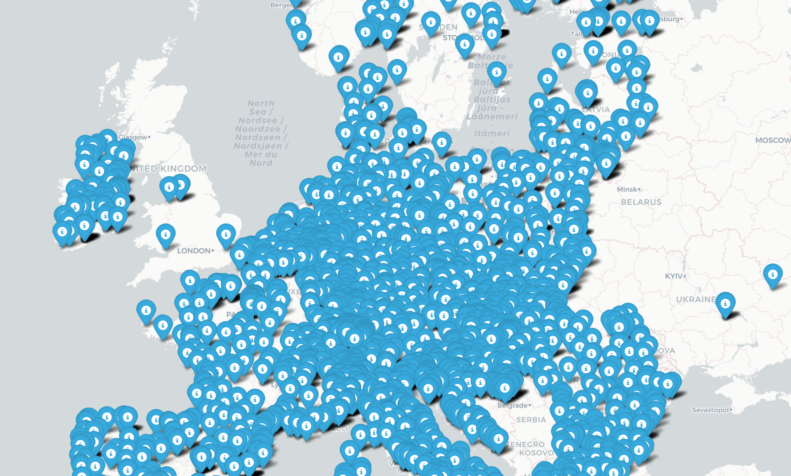

# European Customs Offices Coordinates

This project downloads and processes customs office locations from the EU's official database. It includes geocoding functionality using Google Maps API and interactive map visualization.

## Features

- Downloads official customs offices data from the EU
- Parses XML data into a structured CSV format
- Geocodes addresses using Google Maps API
- Creates an interactive map visualization

## Setup

1. Create a virtual environment (recommended):

```bash
python -m venv venv
source venv/bin/activate  # On Windows: venv\Scripts\activate
```

2. Install dependencies:

```bash
pip install -r requirements.txt
```

3. Set up your Google Maps API key:
   - Get an API key from [Google Cloud Console](https://console.cloud.google.com/)
   - Create a `.env` file in the project root
   - Add your API key: `GOOGLE_MAPS_API_KEY=your_key_here`

## Usage

The workflow consists of four main steps:

1. Download the customs offices data:

```bash
python download_customs_data.py
```

2. Create the initial CSV file:

```bash
python create_offices_csv.py
```

3. Geocode the addresses:

```bash
python geocode_offices.py
```

4. Generate the interactive map:

```bash
python plot_customs_offices.py
```

## Map Visualization

The project generates an interactive map showing all customs offices with their details:



## Data Sources

- Customs Offices Data: [EU Customs Office List](https://ec.europa.eu/taxation_customs/dds2/rd/rd_home.jsp)
- Geocoding: Google Maps API
- Base Map: CartoDB Positron

## License

This project is licensed under the MIT License - see the [LICENSE](LICENSE) file for details.
